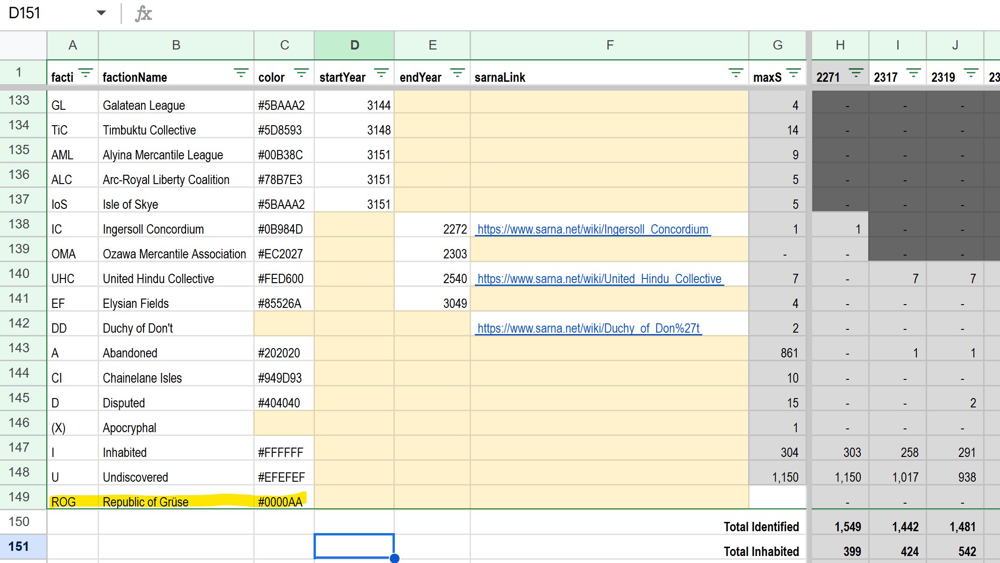
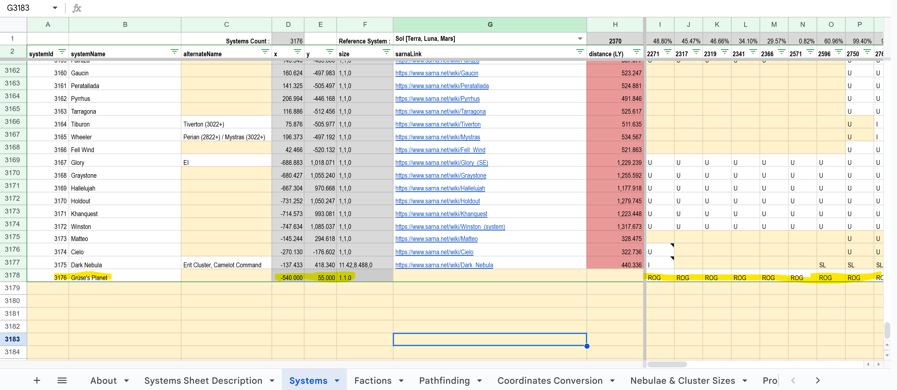
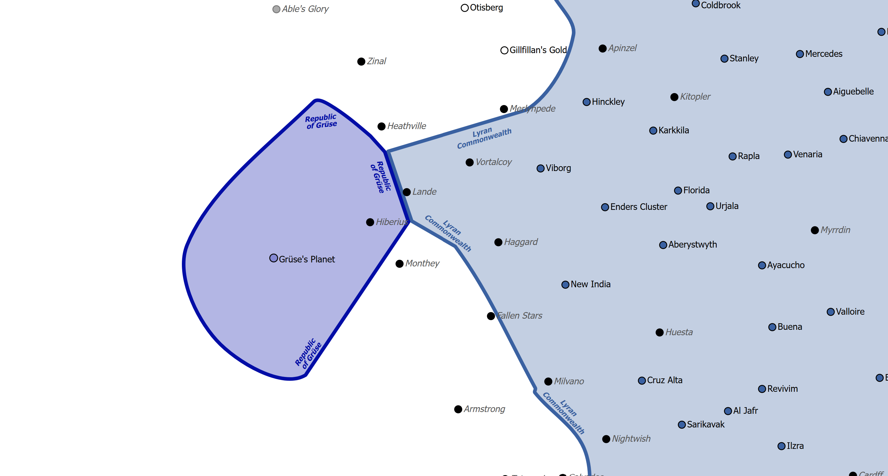

# Creating custom factions and systems

This guide demonstrates how to customize the SUCKit and create your own factions and systems, using a simple example:

Let us assume that we want to create a small faction in the anti-spinward ("west") periphery, called the Republic of Grüse.
This small state should only consist of one system, called Grüse's planet.

In order to get our new faction on the map, we need to take the following steps:

## Make your own private copy of the SUCKit

Navigate to the official SUCKit (https://docs.google.com/spreadsheets/d/1uO6aZ20rfEcAZJ-nDRhCnaNUiCPemuoOOd67Zqi1MVM/edit?gid=546730331#gid=546730331) 
and in the top menu click "File" > "Copy". Save the copy into your own Google Drive. All further steps should now be
taken in your copy of the spreadsheet.

## Add the new faction

In your spreadsheet, go to the Factions tab. Add a new row below the final faction ("Undiscovered"). Your new faction should have a
unique ID, in our example case it is "ROG". Then add the faction name and a hex color, e.g. #FF0000 for bright 
red (google Hex Color Picker if you need help here). All other columns of the Factions tab are irrelevant for the map generation and 
can be safely ignored.

## Add the new system

In your spreadsheet, go to the Systems tab. Add a new row below the final system. The new system should have a unique ID, in our
example case it is 3176. Then add the system's name and its X and Y coordinates. The size cell should be set to "1,1,0" for regular
systems.

Then, still in the systems sheet and your system's row, start at column L and enter the faction affiliations for each era. In our
example case, the system is marked as belonging to our custom faction in all eras.

## Replace the official SUCKit with your custom one locally

Download your custom spreadsheet by clicking "File" > "Download" > "xlsx" and put it into your data folder, rename it to
"Sarna Unified Cartography Kit (Official).xlsx".

## Generate maps

At this point, you should be able to just re-run the map generation, e.g. by going to your console and typing 
"npm start generate innersphere 3025". Here is an example of our output:

